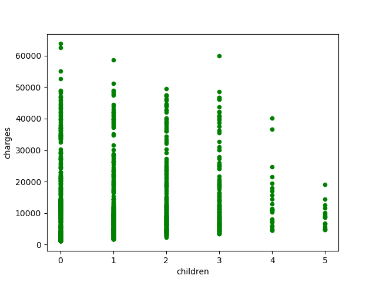
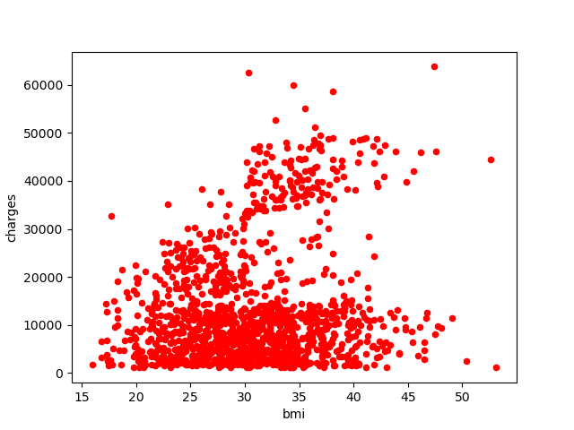
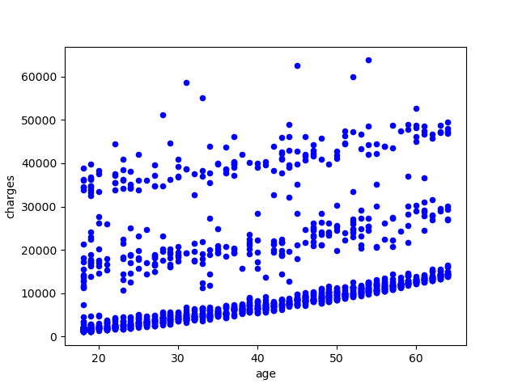

### 0. Abstract

### 1. Introduction (answer what is the real world problem and why it is important)

about half a page

### 2. Dataset selection(collection) and Data pre-processing

#### 2.1 Where you find your data (or how do you collect the data and create your dataset)?
#### 2.2 How do you analyze your data?
#### 2.3 how to pre-process your data to fit your solution?
#### 2.4 Any challenges with your dataset?

