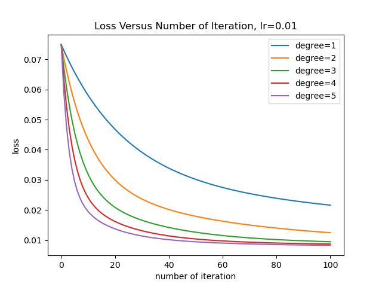
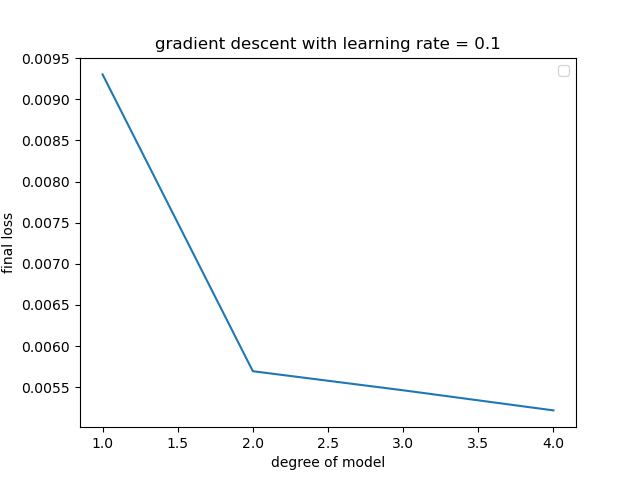
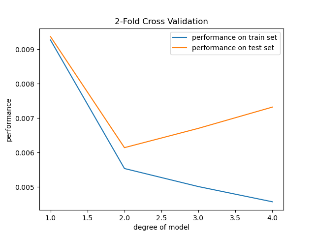
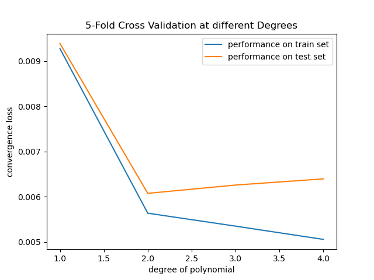

### 0. Abstract
In this assignment, we implemented linear regression algorithms on a personal medical cost datasets 
to forecast insurance cost. We firstly discussed the purpose of this project, 
from the perspective of policyholders, insurance companies, and society. 
Then we introduce the attributes of our dataset, as well as related works. 
Afterwards, we derived the formulas involving calculating the gradient for the regression, 
and the algorithm for iteration. 
We conducted our experiment by using one hot encoding and min-max scaling to preprocess the data, 
implement multiple variable gradient descent and higher degree polynomial regression to find the best way to predicting, 
and also applied K-fold method to validate the model and detect overfitting. 


### 1. Introduction
The purpose of linear regression is to predict the trend, find the law, or find a suitable expression for the data to express a certain trend. In this experiment, we used linear regression to analyze the relationship between the individual insurance costs and the individual's own conditions. We believe that our forecast has a certain impact on policyholders, insurance companies, and social development. 

**For policyholders**: When choosing insurance, this data result helps policyholders to choose the optimal insurance that suits them based on their personal conditions. At the same time, the causality shown by this prediction will also invisibly prompt individuals to pay attention to physical health issues. The results of our forecasts will also help people buy insurance against unpredictable risks in advance and share the risk for the unpredictable future. 

**For insurance companies**: Insurance companies need to receive feedback from society from time to time. By analyzing this information, the insurance companies can keep a balance between the risk and the cost, so as to achieve the maximum benefit; The establishment of decision data model is helpful for enterprises to analyze customer risk level and avoid fraud claim; Data mining can help insurance companies fully explore the value of customers. To be more specific, potential customers may convert them into real customers by using clustering; what’s more, data mining can be applied to customer churn waring analysis for retaining those existing customers. [1]

**For society**: The results of this prediction can be used as a basis for people to purchase insurance to a certain extent. When choosing insurance, this forecast can be used as a reference for policyholders to a certain extent. This forecast can effectively avoid the unhealthy trend of blindly setting insurance premiums in the insurance market. In addition, our research will also increase people's attention to insurance. 

Mining medical insurance data is an effective way to observe the long-term treatment and recovery of diseases. Raedel Michael Through the digital database of a large national insurance company in Germany, this paper tracks the experimental effect of re intervention of restorative treatment of permanent teeth. He also put forward improvement measures from the perspective of public health and the need of optimized strategies [2]. It can be seen that data mining also has great application prospects in disease research and nursing, which should be taken into consideration by the government.

In conclusion, our optimism about the prospects of data mining applications in the insurance industry, coupled with the importance of medical data obtained from insurance policies, constitute the reasons why we chose this direction as our subject.

### 2. Literature Review
We found our data set at [kaggle](https://www.kaggle.com/mirichoi0218/insurance)

The data set is about insurance cost prediction. Tt has seven columns:
- age: age of primary beneficiary
- sex: insurance contractor gender, female, male
- bmi: Body mass index, providing an understanding of body, weights that are relatively high or low relative to height,
objective index of body weight (kg / m ^ 2) using the ratio of height to weight, ideally 18.5 to 24.9
- children: Number of children covered by health insurance / Number of dependents
- smoker: Smoking
- region: the beneficiary's residential area in the US, northeast, southeast, southwest, northwest.
- charges: Individual medical costs billed by health insurance

> other people's work on this data set


### 3. Methodologies
We refer to the gradient descent algorithm introduced in lab2 to finish the linear regression. 
The formulas involving calculate the gradient is shown as follows: 
$$
h(\theta)\text{ is the multiple variable function}
$$

$$
h_{\theta_0, \theta_1, \cdots, \theta_j} = \theta_0 x_0+\theta_1 x_1+\theta_2 x_2+\cdots+\theta_j x_j
$$

$$
\theta = 
\begin{bmatrix}
\theta_0\\\theta_1\\\vdots\\\theta_j
\end{bmatrix},
x = 
\begin{bmatrix}
x_0\\x_1\\\vdots\\x_j
\end{bmatrix}
$$

$$
h_\theta = \theta^{T}x
$$

$$
J(\theta)\text{ is the cost function}
$$

$$
J(\theta) = \frac{1}{m}\sum_{i=1}^{m}(\theta^Tx^{(i)}-y^{(i)})^2
$$

$$
\text{let } t = \theta_0 x_0^{(i)}+\theta_1 x_1^{(i)}+\cdots+\theta_j x_j^{(i)}-y^{(i)}
$$

$$
\text{then, }J(\theta) = \frac{1}{m}\sum_{i=1}^{m}t^2,
$$

$$
\frac{\partial J}{\partial \theta_j} = \frac{\partial J}{\partial t}\frac{\partial t}{\partial\theta_j} = \frac{1}{m}\sum_{i=1}^{m}2tx_j^{(i)}
$$

### 4. Experiment
#### 4.1 Data Preprocessing
##### 4.1.0 Data Analysis
The following is the head of our raw data
```
   age     sex     bmi  children smoker     region      charges
0   19  female  27.900         0    yes  southwest  16884.92400
1   18    male  33.770         1     no  southeast   1725.55230
2   28    male  33.000         3     no  southeast   4449.46200
3   33    male  22.705         0     no  northwest  21984.47061
4   32    male  28.880         0     no  northwest   3866.85520
```
After analyzing we could know that:
- age: 
  - With age, the possibility of getting sick also increases. 
  - The incidence of different diseases varies at different ages.  
  - Therefore, even if people of different ages insured the same product, the premiums payable are different.  
  - **Forecast: within a certain range, the younger you are, the cheaper your insurance premium will be.**    
- sex: Men and women face different risks.
  - The life span of men is generally lower than that of women.
  - Men are more likely to get cancer than women, and the mortality rate is higher than that of women.   
  - There are differences in lifestyles between men and women: Generally speaking, men have more bad habits than women, such as smoking and drinking. Moreover, Men were also less aware of their own health and less likely to go to hospital.
  - Men’s social pressure is greater: in China's family economy at present, there are still more male-dominated families. Men face greater economic pressure and more intense social competition.  
  - **Prediction: In the case of critical illness insurance and life insurance, in most cases men pay more than women; In the case of accident and medical insurance, there is generally no gender difference in premiums.**
- bmi: 
  - The health condition of the insured will affect the premium paid.
  - The insurance company will assess the risk based on the insured’s physical condition. If there is a relevant medical history or the physical condition is poor, the health notification may not be available, and additional fees are required for underwriting, and the premium will be higher, of course.  
**Prediction: We guess that the premium paid by Bmi between 18-24 will be cheaper, because the calculated value within this range is recognized as healthy and normal.**    
- smoker: 
  - Smoking can cause lung cancer, and 90% of the total mortality is caused by smoking. Smoking can also cause blood clots, and it can trigger all kinds of heart disease. Therefore, the mortality rate of these smokers will also increase, and additional premiums are usually required.
  - **Forecast: For people who smoke, their premiums will be higher**
- region:
  - Various environmental factors such as different living habits, behavioral habits, and different climates in the place can affect the individual's physical condition. For example, high salt and cold can lead to high blood pressure, and there are more people with high blood pressure in colder regions; in addition, the difference in diet between North and South is relatively large, and fine grains and large meat will bring obesity, so there are more obese patients in some areas.
- children:
  - The cost of raising multiple children is relatively high. The pressure on parents is greater，when there are more children. Compared to parents with fewer children, parents with many children are more anxious and will have some physical problems. In addition, families with more children put their parents' retirement at greater risk. Therefore, for policyholders with more children, their insurance premiums will increase accordingly.
  - **Prediction: For policyholders, when they have more children, their insurance premiums will be higher when other factors are the same.**

Therefore, it is reasonable to infer that the charges for an insurance is calculated based on the health condition and the lifestyle of the insured person, 
in other words, the first six columns namely age, sex, bmi, number of children, smoke or not, and region should be the independent variable, 
while the charges should be the dependent variable. 
Thus, we come up with the idea that a multivariate function could be used to fit their relationship, 
so that we can predict the insurance cost based on the six main feature of a person.

##### 4.1.1 Data Cleaning
Firstly we need to see how many invalid entries are there in each column. 
[pandas.DataFrame.isnull](https://pandas.pydata.org/pandas-docs/stable/reference/api/pandas.DataFrame.isnull.html) is helpful for this calculation. 
The result is shown like this:
```
age         0
sex         0
bmi         0
children    0
smoker      0
region      0
charges     0
dtype: int64
```
There is no invalid entry in this data set so this stage could be omitted. 

##### 4.1.2 Encoding
The following is information of the data frame
```
<class 'pandas.core.frame.DataFrame'>
RangeIndex: 1338 entries, 0 to 1337
Data columns (total 7 columns):
 #   Column    Non-Null Count  Dtype  
---  ------    --------------  -----  
 0   age       1338 non-null   int64  
 1   sex       1338 non-null   object 
 2   bmi       1338 non-null   float64
 3   children  1338 non-null   int64  
 4   smoker    1338 non-null   object 
 5   region    1338 non-null   object 
 6   charges   1338 non-null   float64
dtypes: float64(2), int64(2), object(3)
memory usage: 73.3+ KB
```
From this table we can see that age, children, and charge are numerical features, 
while sex, smoker, and region are categorical features. 
In order to analyse them and fit them into a linear regression model,
it is necessary to preform some kind of encoding to convert the categorical features to numeric features. 
For smoker and sex, since they are binary attribute, we directly encode yes/no or male/female to 1/0. 
For region, since it has four different categories, we implement one-hot-encoding to convert it to four binary attributes, 
namely southwest, southeast, northwest, northeast. 

After the encoding, the head of the dataframe is shown as this:
```
   age     bmi  children      charges  is_smoker  is_male  southwest  \
0   19  27.900         0  16884.92400          1        0          1   
1   18  33.770         1   1725.55230          0        1          0   
2   28  33.000         3   4449.46200          0        1          0   
3   33  22.705         0  21984.47061          0        1          0   
4   32  28.880         0   3866.85520          0        1          0   

   southeast  northwest  northeast  
0          0          0          0  
1          1          0          0  
2          1          0          0  
3          0          1          0  
4          0          1          0  
```
And the information of the data set is shown as following:
```
<class 'pandas.core.frame.DataFrame'>
RangeIndex: 1338 entries, 0 to 1337
Data columns (total 10 columns):
 #   Column     Non-Null Count  Dtype  
---  ------     --------------  -----  
 0   age        1338 non-null   int64  
 1   bmi        1338 non-null   float64
 2   children   1338 non-null   int64  
 3   charges    1338 non-null   float64
 4   is_smoker  1338 non-null   int64  
 5   is_male    1338 non-null   int64  
 6   southwest  1338 non-null   int64  
 7   southeast  1338 non-null   int64  
 8   northwest  1338 non-null   int64  
 9   northeast  1338 non-null   int64  
dtypes: float64(2), int64(8)
memory usage: 104.7 KB
```
Since all the features are numeric now, we can go on to the next stage. 

##### 4.1.3 Data Observation
###### 4.1.3.1 Distribution
In order to get an overview of the dataset, 
we plot the distributions of the variables firstly. 


It is shown that 
- age is almost uniformly distributed except the range before 20, 
- bim obeys normal distribution, 
- the number of children and the charge seems to be in exponential distributions, 
- male and female take up nearly half of the sample respectively, 
- about one out of four are smoker, 
- the portion of people leaving in southwest, southeast, northwest, and northeast have no significant difference, almost evenly distributed. 

###### 4.1.3.2 Correlations
There are 10 independent variables in our data set after the one hot encoding. 
Some of them may have a strong relationship with the insurance cost, while some of them may not. 
To figure out which variables have the most significant contribution, we could use [pandas.DataFrame.corr](https://pandas.pydata.org/pandas-docs/stable/reference/api/pandas.DataFrame.corr.html)
to calculate correlation between the independent variables and the dependant variable. The result is shown as following: 
```
age          0.299008
bmi          0.198341
children     0.067998
charges      1.000000
is_smoker    0.787251
is_male      0.057292
southwest   -0.043210
southeast    0.073982
northwest   -0.039905
northeast    0.006349
Name: charges, dtype: float64
```
It is shown that is_smoker, age and bmi are the most significant terms. 
Let's plot some figures to show visualize their relationship with charge. 


And we could also plot the scatter matrix to visualize the relationship between every pair of variables. 


##### 4.1.4 Feature Scaling
Since we have seen that in the previous plot there are no outliers in this data set, 
so we choose the min-max scaling method for feature scaling.

$$
scaled = \frac{unscaled - min}{max-min}
$$


After scaling, the head of the data set is shown as following:
```
   is_smoker  is_male  southwest  southeast  northwest  northeast       age  \
0          1        0          1          0          0          0  0.021739   
1          0        1          0          1          0          0  0.000000   
2          0        1          0          1          0          0  0.217391   
3          0        1          0          0          1          0  0.326087   
4          0        1          0          0          1          0  0.304348   

        bmi  children   charges  
0  0.321227       0.0  0.251611  
1  0.479150       0.2  0.009636  
2  0.458434       0.6  0.053115  
3  0.181464       0.0  0.333010  
4  0.347592       0.0  0.043816  
```
We can see that now all the attributes are ranged from 0-1, 
which makes it easy for the linear regression algorithm to converge. 


Since we also record the minimum and maximum value for the original data set, 
it is easy to reverse this process or test new data
```
{'age': {'min': 18, 'max': 64},
 'bmi': {'min': 15.96, 'max': 53.13},
 'children': {'min': 0, 'max': 5},
 'charges': {'min': 1121.8739, 'max': 63770.42801}}
```

#### 4.2 One-Degree Multiple Variables Batch Gradient Descent (GD)
We select the column charges as Y, and the remaining columns joined with a column of 1s as X. 
```
X.shape: (1338, 10)
Y.shape: (1338, 1)
```

The initial theta vectors are set to all zeros since we assume that we have no knowledge about 
the contribution of each attribute at the very beginning. 

To get the most suitable argument for learning rate and number of iteration, 
we come up with an idea that we plot the loss against the number of iteration. 

Here is the figure when the learning rate is set to 0.02 and number of iteration is set to 500. 


It is shown that the loss descended swiftly at the beginning since the gradient was large, 
and converged slowly afterwards since the gradient became small. 

If the learning rate or number of iteration are too small, it may not be totally converged after the training, 
like this figure shows when the learning rate is set to 0.01 and the number of iteration is set to 100:


However, if the learning rate is too high, the regression may never converge, 
like this figure shows when the learning rate is set to 0.5 and the number of iteration is set to 20:


The final result of the one-degree gradient descent model is that 
the minimum loss is about 0.0093, 
and the corresponding theta vector is
```python
[[-0.04155146] 
 [ 0.38043647] # is_smoker
 [-0.00207574] # is_male
 [-0.01633501] # southwest
 [-0.01636002] # southeast
 [-0.00723836] # northwest
 [-0.00161808] # northeast
 [ 0.18908899] # age
 [ 0.18676482] # bmi
 [ 0.03755355]]# children
```
We can compare it with the correlation coefficient calculated previously 

attribute | correlation coefficient | final theta vector
----------|-------------------------|-------------------
ones      |                         |-0.04155146
is_smoker | 0.787251                | 0.38043647
is_male   | 0.057292                | 0.00207574
southwest |-0.043210                |-0.01633501
southeast | 0.073982                |-0.01636002
northwest |-0.039905                |-0.00723836
northeast | 0.006349                |-0.00161808
age       | 0.299008                | 0.18908899
bmi       | 0.198341                | 0.18676482
children  | 0.067998                | 0.03755355

#### 4.3 Higher Degree Multiple Variables Polynomial Regression
Although one degree linear regression could give a good prediction which has an error smaller than 1%, 
it is not perfect for this dataset. 
The reason is that from common sense we know that a very high bmi or a very low bmi are all not health, 
only the one in the middle are in best condition, 
and from the relationship between age and charge we could see that it is not a straight line, 
instead, it is a curve with a positive second-degree derivative, 
in other words charge is more sensitive in the increasing of age if a person is old. 
This information tell us that a higher degree model could have a better performance in predicting the charge. 

To implement polynomial regression, we need to generate a new feature matrix 
consisting of all polynomial combinations of the features with degree less than or equal to the specified degree. 
Fortunately, [sklearn.preprocessing.PolynomialFeatures](https://scikit-learn.org/stable/modules/generated/sklearn.preprocessing.PolynomialFeatures.html)
could help us finish this task easily. 
$$
\text{example: } [a, b] \rightarrow [1, a, b, a^2, ab, b^2]
$$

Then, similar to the previous section, we can train a polynomial regression model as a linear regression model using gradient descent algorithm. 
However, this time we have multiple model with the same learning rate and different degrees. 
We can plot the changing history of loss in the same figure, as shown in the following:



It is easy to see that the higher the degree of the model, 
the faster the convergence will be, and the lower the final cost will reach. 

We can set a convergence condition to let the algorithm to auto-decide whether the gradient descent has converged or not, 
if the difference in loss between two adjacent iteration is smaller than a threshold value, 
the regression is defined to be converged. In this experiment the threshold is set to 0.00000001. 
Under this definition, the number of iteration and the minimum loss of different models are:

degree | number of iteration | minimum loss
-------|---------------------|-------------
 1     | 1109                | 0.009302    
 2     | 4203                | 0.005694    
 3     | 7858                | 0.005462    
 4     | 12050               | 0.005218


We can plot the converged loss in models against different degree. 



Here at the degree of 2 there is an obvious elbow, 
indicating the degree higher than 2 will not bring performance improvement as much as from degree 1 to degree 2. 
And maybe with high degree there is overfitting issues, which leads to the validation in out next section. 


### 4.4 Validation
To validation the performance of model and see if there is overfitting issues, 
the models should be trained on train set and tested on test set. 
The [K-fold Cross Validation](https://en.wikipedia.org/wiki/Cross-validation_(statistics)) method could ensure that all data participate equally train set ot test set K times. 

The result of a 2-Fold validation is shown as following: 



It shows that starts at the degree higher than 2,
there is more and more serious overfitting problems. 

The overfitting could be reduced by simply adding more data in each train set, 
like this figure shows when K is set to 5, indicating there are 60% more data than the previous one in each train-set process: 



Nevertheless, the most important method to reduce overfitting is that we should constrain the model which is too complicated, 
by reduced the degree of polynomial. In this experiment the best model should have 2-degree. 


### 5. Conclusion
The result of our experiment shown that using a linear regression model whose degree is one
could predict the insurance cost with error smaller than 1%, 
using a polynomial regression model whose degree is two could bring more precise prediction. 
However, if the degree of the model is higher than 2, 
the overfitting problem becomes serious, 
and the loss on test set indicates that the performance will not continue improving as the degree of polynomial grows. 
Another good way to reduce overfitting is to use hyperparameter, 
so than when measure cost the sum of parameter value (vector theta) are also counted, 
but due to the limitation of the page number, this method is not introduced. 


### References
1. https://d.wanfangdata.com.cn/thesis/Y2415220
2. Raedel, M., Hartmann, A., Priess, H., Bohm, S., Samietz, S., Konstantinidis, I. & Walter, M.H. 2017, "Re-interventions after restoring teeth--Mining an insurance database", Journal of dentistry, vol. 57, pp. 14-19.